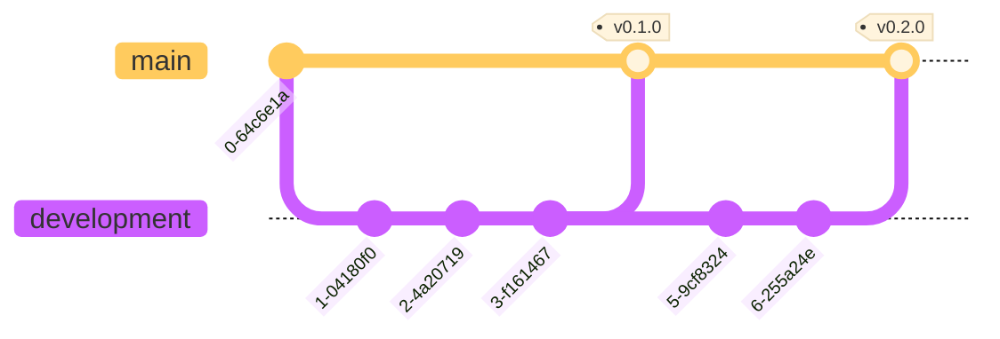

# Contribution Guidelines

This is a document to establish the expected contribution workflow for the
project. It explains how the project is structured at an organization-wide
level. The entirety of this project will be handled in English. Both in the
repositories' issues, PRs and commits, as well as in the code itself through
comments and any sort of naming utilized for variables, functions, endpoints,
etc..

## Table of Contents

<ul>
    <li>
        <details open>
            <summary>
                <a href=#1-working-with-issues>
                    1. Working with Issues
                </a>
            </summary>
            <ul>
                <li>
                    <a href=#11-when-to-use-issues>
                        1.1. When to use Issues
                    </a>
                </li>
                <li>
                    <details open>
                        <summary>
                            <a href=#12-issue-types>
                                1.2. Issue Types
                            </a>
                        </summary>
                        <ul>
                            <li>
                                <a href=#121-what-are-issue-types>
                                    1.2.1. What are Issue Types?
                                </a>
                            </li>
                            <li>
                                <a href=#122-available-issue-types>
                                    1.2.2. Available Issue Types
                                </a>
                            </li>
                            <li>
                                <a href=#123-responsibility-for-issue-types>
                                    1.2.3. Responsibility for Issue Types
                                </a>
                            </li>
                        </ul>
                    </details>
                </li>
                <li>
                    <details open>
                        <summary>
                            <a href=#13-sub-issues>
                                1.3. Sub-Issues
                            </a>
                        </summary>
                        <ul>
                            <li>
                                <a href=#131-what-are-sub-issues>
                                    1.3.1. What are sub-issues?
                                </a>
                            </li>
                            <li>
                                <a href=#132-using-sub-issues>
                                    1.3.2. Using Sub- Issues
                                </a>
                            </li>
                        </ul>
                    </details>
                </li>
                <li>
                    <details open>
                        <summary>
                            <a href=#14-issue-forms>
                                1.4. Issue Forms
                            </a>
                        </summary>
                        <ul>
                            <li>
                                <a href=#141-what-are-issue-forms>
                                    1.4.1. What are Issue Forms?
                                </a>
                            </li>
                            <li>
                                <a href=#142-using-issue-forms>
                                    1.4.2. Using Issue Forms
                                </a>
                            </li>
                        </ul>
                    </details>
                </li>
            </ul>
        </details>
    </li>
    <li>
        <details open>
            <summary>
                <a href=#2-working-with-prs>
                    2. Working with PRs
                </a>
            </summary>
            <ul>
                <li>
                    <a href=#21-when-to-use-prs>
                        2.1. When to use PRs?
                    </a>
                </li>
                <li>
                    <a href=#22-create-pr>
                        2.2. Create PR
                    </a>
                </li>
                <li>
                    <a href=#23-reviewing-prs>
                        2.3. Reviewing PRs
                    </a>
                </li>
                <li>
                    <a href=#24-merging-prs>
                        2.4. Merging PRs
                    </a>
                </li>
            </ul>
        </details>
    </li>
    <li>
        <details open>
            <summary>
                <a href=#3-github-workflow>
                    3. GitHub Workflow
                </a>
            </summary>
            <ul>
                <li>
                    <a href=#31-creating-a-feature-branch>
                        3.1. Creating a feature branch
                    </a>
                </li>
                <li>
                    <details>
                        <summary>
                            <a href=#32-commiting-changes>
                                3.2. Commiting changes
                            </a>
                        </summary>
                        <ul>
                            <li>
                                <a href=#321-conventional-commits>
                                    3.2.1. Conventional Commits
                                </a>
                            </li>
                            <li>
                                <a href=#322-atomic-commits>
                                    3.2.2. Atomic Commits
                                </a>
                            </li>
                            <li>
                                <a href=#323-signed-commits>
                                    3.2.3. Signed Commits
                                </a>
                            </li>
                        </ul>
                    </details>
                </li>
                <li>
                    <a href=#33-pushing-changes>
                        3.3. Pushing changes
                    </a>
                </li>
                <li>
                    <a href=#34-pulling-changes>
                        3.4. Pulling changes
                    </a>
                </li>
                <li>
                    <a href=#35-test-locally>
                        3.5. Test locally
                    </a>
                </li>
                <li>
                    <a href=#36-PR-to-base-branch>
                        3.6. PR to base branch
                    </a>
                </li>
            </ul>
        </details>
    </li>
    <li>
        <details open>
            <summary>
                <a href=#4-release-workflow>
                    4. Release Workflow
                </a>
            </summary>
            <ul>
                <li>
                    <a href=#41-testing-development>
                        4.1. Testing `development`
                    </a>
                </li>
                <li>
                    <details open>
                        <summary>
                            <a href=#42-planning-a-release>
                                4.2. Planning a Release
                            </a>
                        </summary>
                        <ul>
                            <li>
                                <a href=#421-milestones>
                                    4.2.1. Milestones
                                </a>
                            </li>
                            <li>
                                <a href=#422-git-tags-as-releases>
                                    4.2.2. Git Tags as Releases
                                </a>
                            </li>
                            <li>
                                <a href=#423-semantic-versioning>
                                    4.2.3. Semantic Versioning
                                </a>
                            </li>
                        </ul>
                    </details>
                </li>
                <li>
                    <details open>
                        <summary>
                            <a href=#43-publishing-a-release>
                                4.3. Publishing a Release
                            </a>
                        </summary>
                        <ul>
                            <li>
                                <a href=#431-creating-a-pr>
                                    4.3.1. Creating a PR
                                </a>
                            </li>
                            <li>
                                <a href=#432-merging-a-release>
                                    4.3.2. Merging a Release
                                </a>
                            </li>
                            <li>
                                <a href=#433-tagging-a-release>
                                    4.3.3. Tagging a Release
                                </a>
                            </li>
                            <li>
                                <a href=#434-release-git-diagram>
                                    4.3.4. Release `git` Diagram
                                </a>
                            </li>
                        </ul>
                    </details>
                </li>
            </ul>
        </details>
    </li>
    <li>
        <details open>
            <summary>
                <a href=#5-bug-reporting>
                    5. Bug Reporting
                </a>
            </summary>
            <ul>
                <li>
                    <a href=#51-when-to-bug-report>
                        5.1. When to Bug Report?
                    </a>
                </li>
                <li>
                    <a href=#52-bug-report-or-reopen-issue>
                        5.2. Bug Report or Reopen Issue?
                    </a>
                </li>
                <li>
                    <a href=#53-creating-a-bug-report>
                        5.3. Creating a Bug Report
                    </a>
                </li>
            </ul>
        </details>
    </li>
    <li>
        <details open>
            <summary>
                <a href=#6-documentation>
                    6. Documentation
                </a>
            </summary>
            <ul>
                <li>
                    <a href=#61-code-style-and-documentation>
                        6.1. Code Style and Documentation
                    </a>
                </li>
                <li>
                    <a href=#62-changelog>
                        6.2. CHANGELOG
                    </a>
                </li>
                <li>
                    <a href=#63-github-wiki>
                        6.3. GitHub Wiki
                    </a>
                </li>
            </ul>
        </details>
    </li>
    <li>
        <a href=#7-issue-tracking-and-closing>
            7. Issue Tracking and Closing
        </a>
    </li>
</ul>

## 1. Working with Issues

[Back to top &#x21e7;](#contribution-guidelines)

### 1.1. When to use Issues

For any sort of technical, development, and software related work that is
required for the project, consider utilizing issues. Issues provide a way to
track work via feature development branches, issue discussions, labels,
assignees, eventually Pull Requests (PR)s, and can be linked to a GitHub
Project, which allows for better Project Management.

[Back to top &#x21e7;](#contribution-guidelines)

### 1.2. Issue Types

[Back to top &#x21e7;](#contribution-guidelines)

#### 1.2.1. What are Issue Types?

Issue Types allow an organization to better manage the different nature of the
various issues accross multiple repositories. They provide a clear distinction
between issues and are ordered according to the level of specificity they have
related to the project.
[Learn more](https://docs.github.com/en/issues/tracking-your-work-with-issues/configuring-issues/managing-issue-types-in-an-organization)

[Back to top &#x21e7;](#contribution-guidelines)

#### 1.2.2. Available Issue Types

1. Epic: Collection of User Stories for an overarching project requirement.
2. Sub-Epic: Specialized collection of User Stories for related project
   requirements.
3. User Story: A feature, request, idea or new functionality.
4. Task: A specific piece of work.
5. Sub-Task: A highly specific piece of work that builds towards a task.
6. Bug: An unexpected problem or behaviour.

[Back to top &#x21e7;](#contribution-guidelines)

#### 1.2.3. Responsibility for Issue Types

- Project Managers (PM)s and Lead Architects (LA)s.
    - Epics
    - Sub-Epics
- Team-Leads and Repository Maintainers
    - User Stories
- Anyone
    - Tasks
    - Sub-Tasks
    - Bugs

[Back to top &#x21e7;](#contribution-guidelines)

### 1.3. Sub-Issues

[Back to top &#x21e7;](#contribution-guidelines)

#### 1.3.1. What are Sub-Issues?

Sub-Issues allow for parent-child relationships for issue management, and
allow for the sub-division of bigger and more complex issues into smaller, and
simpler issues that can be more easily discussed, managed and developed.
[Learn more](https://docs.github.com/en/issues/tracking-your-work-with-issues/using-issues/adding-sub-issues)

[Back to top &#x21e7;](#contribution-guidelines)

#### 1.3.2. Using Sub-Issues

The way that the various Issue Types are structured, it is expected that
smaller and more specific issue types are always created as sub-issues of
larger issue types.

There are 3 main ways to work with sub-issuse:

1. Create a brand new issue as a sub-issue from an existing issue.
2. Add an existing issue as a sub-issue of an existing issue.
3. Add an existing issue as a parent of an existing issue.

The parent-child relationship can span separate repositories, so it's okay to
create an issue in a submodule and then declare an issue in the main
repository as its parent. For Tasks and Sub-Tasks, it is best to create the
issues on their corresponding repositories and then declare the appropriate
User Story or Task as its parent issue.

Rather than creating them as sub-issues in the main repository and later
transfering the issue to its corresponding repository. This latter workflow
should be reserved for PMs and LAs only.

[Back to top &#x21e7;](#contribution-guidelines)

### 1.4. Issue Forms

#### 1.4.1. What are Issue Forms?

Issue forms are an improved version of issue templates which allowed for much
more structure when creating an issue. In exchange for flexibility, issue
forms provide a more consistent and reliable syntax for any issues created in
a repository.
[Learn more](https://docs.github.com/en/communities/using-templates-to-encourage-useful-issues-and-pull-requests/configuring-issue-templates-for-your-repository#creating-issue-forms)

[Back to top &#x21e7;](#contribution-guidelines)

#### 1.4.2. Using Issue Forms

There are currently 5 different issue forms, all correlating to the various
issue types according to the levels of granularity normally encountered in the
project. To use issue forms, simply

1. Create a new issue.
2. Choose the corresponding issue form for it.
3. Fill out all of the required fields.
4. Add any missing details not pre-determined by the issue form.
    - Assignees
    - Labels
    - Milestones

[Back to top &#x21e7;](#contribution-guidelines)

## 2. Working with PRs

[Back to top &#x21e7;](#contribution-guidelines)

### 2.1. When to use PRs

TL;DR: Always. Any sort of change that has finished initial development should
utilize a Pull Request to _request_ (suggest) that the contents developed in
some branch can be _pulled_ (merged) into the `development` branch for testing
and eventual inclusion in a release.

[Back to top &#x21e7;](#contribution-guidelines)

### 2.2. Create PR

1. Create a PR to the `development` branch
2. Add the appropriate labels
3. Assign the people responsible for merging the PR
4. Assign the people responsible for reviewing the changes proposed.
5. In the description, explain:
    - What the changes you made add to the project
    - How they change the behaviour of the software
    - The rationale behind it
    - What Task or Sub-Task it aims to resolve.
6. Ensure the PR is linked to its corresponding Task or Sub-Task.
   (This should be done automatically if the branch was created from a
   particular issue in the first place.)
   [Learn more](https://docs.github.com/en/pull-requests/collaborating-with-pull-requests/getting-started/helping-others-review-your-changes)

[Back to top &#x21e7;](#contribution-guidelines)

### 2.3. Reviewing PRs

Once the PR is created, the QA team will:

1. Review the changes proposed
2. Ensure that they do indeed build towards the intended feature
3. Leave a review on the PR to either:
    - **Approve** the changes and add a comment explaining that the changes
      provided do indeed contribute towards the development of the project.
    - **Comment** on the PR regarding questions they may have regarding the PR.
    - **Request Changes** directly stating what needs to be changed for the PR
      to be approved.

When commenting or requesting changes after a review, reviewers can add
comments to individual lines or files. Comments are intended to mark that
something needs attention. So they mustn't be used to say that something works
as intended. Additionally, reviewers can even suggest changes while adding
comments to individual lines. These suggested changes can even be applied
directly on GitHub in a new commit.
[Learn more](https://docs.github.com/en/pull-requests/collaborating-with-pull-requests/reviewing-changes-in-pull-requests/about-pull-request-reviews)

[Back to top &#x21e7;](#contribution-guidelines)

### 2.4. Merging PRs

Once a feature has the required approving reviews, it can be merged to the
`development` branch using the merge option. This will mean the related issue
is marked as complete, and the feature branch is deleted.
[Learn more](https://docs.github.com/en/pull-requests/collaborating-with-pull-requests/incorporating-changes-from-a-pull-request/merging-a-pull-request)

[Back to top &#x21e7;](#contribution-guidelines)

## 3. GitHub Workflow

The project will follow GitHub Flow for its feature development.
[Learn more](https://docs.github.com/en/get-started/using-github/github-flow)

[Back to top &#x21e7;](#contribution-guidelines)

### 3.1. Creating a feature branch

In order to start working on an issue, first a feature branch must be created
dedicated exclusively to addressing that specific issue. These should be
created using GitHub (or `gh` CLI) for the default name to be used:
`[ issue number ]-[ issue title ]`. This automatically links the branch to said
issue and it makes it clear that that issue is actively being worked on, even
if no PR exists yet.

The base branch (the branch from which it is created) for the feature branch
depends on the type of issue that it aims to address:

- **Task Issue**: base branch is `development`.

    ```mermaid
    ---
    config:
        theme: base
    ---
    gitGraph
        commit
        commit
        branch development
        commit
        commit
        branch 1-task-foo
        commit
        commit
    ```

- **Sub-Task Issue**: base branch is the corresponding and pre-existing
  `[ issue number ]-task-[ task title]` parent task issue branch.

    ```mermaid
    ---
    config:
        theme: base
    ---
    gitGraph
        commit
        commit
        branch development
        commit
        commit
        branch 1-task-foo
        commit
        commit
        branch 2-sub-task-bar
        commit
        commit
    ```

- **Chore**: base branch is either `main` or `development`, depending on the
  nature of the chore.

    ```mermaid
    ---
    config:
        theme: base
    ---
    gitGraph
        commit
        commit
        branch development
        commit
        commit
        branch 1-task-dev-chore
        commit
        commit
        switch main
        branch 2-task-main-chore
        commit
        commit
    ```

[Back to top &#x21e7;](#contribution-guidelines)

### 3.2. Commiting changes

[Back to top &#x21e7;](#contribution-guidelines)

### 3.2.1 Conventional Commits

Once a development branch has been created an is linked to the issue that it's
developing, make and commit changes in that feature branch. The commits should
follow the conventional commits standard for the commit message structure. It
has 3 main parts:

```git
<type>[optional scope]: <description>

[optional body]

[optional footer(s)]
```

The `<type>` can be one of:

- `fix`
- `feat`
- `build`
- `chore`
- `ci`
- `docs`
- `style`
- `refactor`
- `perf`
- `test`

And the `<description>` must be short and start with lowercase.
[Learn more](https://www.conventionalcommits.org/en/v1.0.0/)

[Back to top &#x21e7;](#contribution-guidelines)

### 3.2.2. Atomic Commits

The nature of a commit should be atomic. That is, that each commit should only
encompass a single change to the code. This means that a single commit should
have a clear and identifiable purpose, and not cover multiple changes
simultaneously. In the future, this will make it easier to understand the
commit history, more easily review proposed changes, and also revert any
faulty commits and identify problems more easily.
[Learn more](https://github.blog/developer-skills/github/write-better-commits-build-better-projects/)

[Back to top &#x21e7;](#contribution-guidelines)

### 3.2.3. Signed Commits

In addition, all commits made to the project must be signed, either with an
SSH, or GPG private key linked to the contributor's GitHub account for the
commits to be marked as _verified_ and included into the project.
[Learn more](https://docs.github.com/en/authentication/managing-commit-signature-verification/signing-commits)

[Back to top &#x21e7;](#contribution-guidelines)

### 3.3. Pushing changes

Once a set of commits are ready to be worked on by someone else, or can be
considered a complete piece of work, they can be pushed to the remote
repository. There is no need to be pushing every single commit to the remote
if the commits are considered to be work in progress (WIP).

Pushed commits **must** have the correct conventional commit format, and be
organized in such a manner that later review process, integration, and possible
revertion and bug fixing can be easily done by looking at the commit history.

[Back to top &#x21e7;](#contribution-guidelines)

### 3.4. Pulling changes

Feature branches should always have a single owner. This means that only a
single person should be working in a determined feature at any point. This
prevents any sort of conflicts from emerging between the local and remote
feature branches.

Feature branches should always be developed independently from its
corresponding base branch (see [Section 3.1](#31-creating-a-feature-branch))
and only pull changes from it if they directly affect the development of said
feature, as signaled in a corresponding PR previously merged to said base
branch which links this feature as an affected issue.

There is no need to be constantly updating the branch to be in sync with
its corresponding base branch
(see [Section 3.1](#31-creating-a-feature-branch)). Only when required to make
development adjustments or once the development is finished and there are any
conflicts that need to be fixed.
[Learn more](https://git-scm.com/docs/gitworkflows#_topic_branches)

The following are some examples as to how this could look like for the
different issue types:

- **Task Issue**

    ```mermaid
    ---
    config:
        theme: base
    ---
    gitGraph
        commit
        commit
        branch development
        commit
        branch 1-task-foo
        commit
        switch development
        branch 2-task-bar
        commit
        switch development
        merge 2-task-bar
        switch 1-task-foo
        merge development
        commit
    ```

- **Sub-Task Issue**

    ```mermaid
    ---
    config:
        theme: base
    ---
    gitGraph
        commit
        commit
        branch development
        commit
        commit
        branch 1-task-foo
        commit
        commit
        branch 2-sub-task-bar
        commit
        switch 1-task-foo
        branch 3-sub-task-baz
        commit
        switch 1-task-foo
        merge 3-sub-task-baz
        switch 2-sub-task-bar
        merge 1-task-foo
        commit
    ```

- **Chore**

    ```mermaid
    ---
    config:
        theme: base
    ---
    gitGraph
        commit
        branch development
        commit
        branch 1-task-foo
        commit
        switch development
        branch 2-task-dev-chore
        commit
        switch development
        merge 1-task-foo
        switch 2-task-dev-chore
        merge development
        commit
        switch main
        branch 3-task-main-chore
        commit
        switch main
        merge development
        switch 3-task-main-chore
        merge main
        commit
    ```

[Back to top &#x21e7;](#contribution-guidelines)

### 3.5. Test locally

Before requesting to pull any changes worked on for the feature into its
corresponding base branch (see [Section 3.1](#31-creating-a-feature-branch)),
make sure to add unitary and integration tests as required to identify any bugs
or malfuctions in the feature's code without having to test the entire
application as a whole as part of the QA workflow.

[Back to top &#x21e7;](#contribution-guidelines)

### 3.6. PR to base branch

Once a feature has been thoroughly tested locally, a PR can be created into
its corresponding base branch (see [Section 3.1](#31-creating-a-feature-branch))
to integrate the feature to the current batch of features in testing.

The following are examples of how this would look like for each issue type:

- **Task Issue**

    ```mermaid
    ---
    config:
        theme: base
    ---
    gitGraph
        commit
        commit
        branch development
        commit
        commit
        branch 1-task-foo
        commit
        switch development
        merge 1-task-foo
    ```

- **Sub-Task Issue**

    ```mermaid
    ---
    config:
        theme: base
    ---
    gitGraph
        commit
        commit
        branch development
        commit
        commit
        branch 1-task-foo
        commit
        branch 2-sub-task-bar
        commit
        switch 1-task-foo
        merge 2-sub-task-bar
    ```

- **Chore**

    ```mermaid
    ---
    config:
        theme: base
    ---
    gitGraph
        commit
        commit
        branch development
        commit
        commit
        branch 1-task-dev-chore
        commit
        switch development
        merge 1-task-dev-chore
        switch main
        branch 2-task-main-chore
        commit
        switch main
        merge 2-task-main-chore
    ```

[Back to top &#x21e7;](#contribution-guidelines)

## 4. Release Workflow

This Workflow is intended to integrate the `development` branches into the
`main` branch of a repository.

[Back to top &#x21e7;](#contribution-guidelines)

### 4.1. Testing `development`

Before considering any sort of new release, the `development` branch is
intended to serve as a testing ground. Here, the QA team should conduct
integration tests to ensure that any features merged into `development` and
not yet released to `main` work as intended and no unforseen bugs appear once
the whole system is tested.

[Back to top &#x21e7;](#contribution-guidelines)

### 4.2. Planning a Release

[Back to top &#x21e7;](#contribution-guidelines)

#### 4.2.1. Milestones

GitHub allows the control and planning of new releases utilizing milestones,
which outline the description of the new release, the deadline for its release,
and the scope of the release by linking related issues for its completion.

They allow for better project management by setting progress markers for the
project, and tracking progress towards any given milestones by comparing the
number of finished and unfinished issues the milestone has, assuming that all
issues are the same size.

Adding or removing issues is allowed, and a milestone can be considered
complete once 100% of the issues assigned to said milestone have been completed.
[Learn more](https://docs.github.com/en/issues/using-labels-and-milestones-to-track-work/about-milestones)

[Back to top &#x21e7;](#contribution-guidelines)

#### 4.2.2. Git Tags as Releases

GitHub consideres releases to be a specific version of the repository marked
by a `git` tag. These should only exist on the `main` branch of the repository
and contain the software version related to that specific release.
[Learn more](https://docs.github.com/en/repositories/releasing-projects-on-github/about-releases)

[Back to top &#x21e7;](#contribution-guidelines)

#### 4.2.3. Semantic Versioning

Any release implies a new software version, and it **must** utilize semantic
versioning (SemVer), which has the format `MAJOR.MINOR.PATCH`. And the new
version of any release is determined by the highest order of change introduced.

So a release that introduces `MINOR` and `PATCH` changes should be considered a
new `MINOR` version. And the `MAJOR`, `MINOR` and `PATCH` are determined by the
types of commits the release introduces.

- `MAJOR` to any commit type with `!` and `BREAKING CHANGES` footer.
- `MINOR` to any `feat` commit type.
- `PATCH` to any `fix` commit type.

Due to the project's development being comprised as mostly it being in a
prerelease state, with the final project objective being a `1.0.0` version,
all versions prior to the finish of the project should be considered `0.x.z`,
starting with `0.1.0`.

This means that `MINOR` and `PATCH` versions are the only types of versions
that should be considered. Since `MAJOR` or `BREAKING CHANGES` apply once a
stable release has been established. Hence any sort of prerelease `MAJOR`
change should instead be treated as a `MINOR` change for semantic versioning.
[Learn more](https://SemVer.org/)

[Back to top &#x21e7;](#contribution-guidelines)

### 4.3. Publishing a Release

[Back to top &#x21e7;](#contribution-guidelines)

#### 4.3.1. Creating a PR

Once a new release is complete and tested in the `development` branch, a PR
can be created to the `main` branch. This PR should include the `CHANGELOG`
the new release introduces compared to the latest available release. It should
also include an update to a `CHANGELOG` file [Learn more](https://keepachangelog.com/en/1.0.0/)

[Back to top &#x21e7;](#contribution-guidelines)

#### 4.3.2. Merging a Release

Once the release has been apropriately reviewed and approved, it should be
merged into the `main` branch utilizing the merge method, which creates a
merge commit with the information of the release's PR.

This means that the history of the `main` branch will mainly only contain the
merge commits as first parents. However, still contain all of the commit
history carried over from `development`. Which keeps the commit history
complete but also clean when analyzed on a first-parent basis.

[Back to top &#x21e7;](#contribution-guidelines)

#### 4.3.3. Tagging a Release

Each release merged to the `main` branch should include a `git` tag with the
release version in the format `vMAJOR.MINOR.PATCH` and a message indicating
`Release vMAJOR.MINOR.PATCH`. These types of tags **must** exist **only** in
the `main` branch, but alternate tags are allowed to track progress in the
`development` and feature branches.

[Back to top &#x21e7;](#contribution-guidelines)

#### 4.3.4. Relese `git` Diagram

The following is a diagram to show what releases should look like:



[Back to top &#x21e7;](#contribution-guidelines)

## 5. Bug Reporting

[Back to top &#x21e7;](#contribution-guidelines)

### 5.1. When to Bug Report?

Bug reporting should only occur once a release has been made, and an error or
unexpected behaviour is found to occurr in the release, a new bug report
should be created to communicate that something is not working as intended
when considering all modules of the software.

[Back to top &#x21e7;](#contribution-guidelines)

### 5.2. Bug Report or Reopen Issue?

If something is still in `development` and doesn't work properly, that
specific feature which is not working properly should be addressed by:

1. Reverting the merge commit made to `development`.

2. Reopening the issue with a description of what was found to be
   malfunctioning.

3. Fixing the issue.

4. Reintegrating the issue into `development`.

[Back to top &#x21e7;](#contribution-guidelines)

### 5.3. Creating a Bug Report

The most important thing a bug report should have are:

- The intended behaviour
- The current behaviour
- The steps to reproduce such bug

Beyond this, any sort of appreciated information could perhaps be:

- Console logging information
- Error messages

And any sorf of information that would aid the developers error guessing what
is wrong.

[Back to top &#x21e7;](#contribution-guidelines)

## 6. Documentation

This section will outline the project documentation requirements not related to
code specifics, but rather to the documentation of the project as a whole.

[Back to top &#x21e7;](#contribution-guidelines)

### 6.1. Code Style and Documentation

Code style guidelines and code documentation guidelines should be defined in
separate and dedicated `CONTRIBUTING` files in each repository, dealing with
the specific code format requirements, and code documentation specifications.
These could be located both at the root of the repository, as well as in a
`docs` directory at the root of the repository, if preferred.

[Back to top &#x21e7;](#contribution-guidelines)

### 6.2. CHANGELOG

A `CHANGELOG` file should be kept to which outlines the changes being made from
each release. These files are repository-wide, but a project-wide `CHANGELOG`
file should also be kept in the main repository to outline how the Project as a
whole has been evolving. Keep in mind the following things:

- It should be human-readable
- There should be an entry for each release version.

With the following types of changes:

1. `Security` in case of vulnerabilities.
2. `Removed` for now removed features.
3. `Deprecated` for soon-to-be removed features.
4. `Added` for new features.
5. `Changed` for changes in existing functionality.
6. `Fixed` for any bugfixes.

Keeping an `Unreleased` section at the top to track upcoming changes is
preferable for maintaining the `CHANGELOG` file.
[Learn more](https://keepachangelog.com/en/1.0.0/)

[Back to top &#x21e7;](#contribution-guidelines)

### 6.3. GitHub Wiki

The GitHub Wiki will serve the purpose of documenting how the project works.
Both from a technical point of view, as well as a user manual.

[Back to top &#x21e7;](#contribution-guidelines)

## 7. Issue Tracking and Closing

In order to close an Issue, it has to have been developed. Which means that
it's corresponding feature branch must have already been directly or indirectly
merged with a PR to its base branch (see [Section 3.6](#36-pr-to-base-branch)).

However this doesn't mean that the issue is fully complete necessarily. In the
case of User Stories, Sub-Epics and Epics, they can be further tracked to be:

1. **Module staged**: In a Release PR of a submodule repository.
2. **Module released**: Released in a submodule repository.
3. **Project staged**: In a Release PR of the project repository.
4. **Project released**: Released in the project repository.

A User Story, Sub-Epic or Epic should only be considered complete once it has
been project released. And its status is determined by the lowest status any of
its sub-issues has. So if an Epic is fully module released, except for a single
User Story which is still only Module Staged, then the Epic itself is still
Module Staged. Even if other User Stories and Sub-Epics are not.

[Back to top &#x21e7;](#contribution-guidelines)
