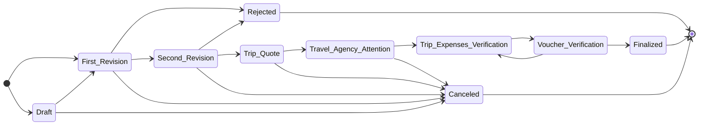

# TC3005B.501
Portal web para que empresas puedan tener un flujo de solicitud de viajes por parte de los empleados que requieran algún tipo de apoyo por parte de la empresa. Ya sea en materia de reembolso, anticipo, reservaciones de hotel y/o de vuelos.

## Process State Diagram

The process of processing a travel request application is represented by the following state diagram from start to finish:

